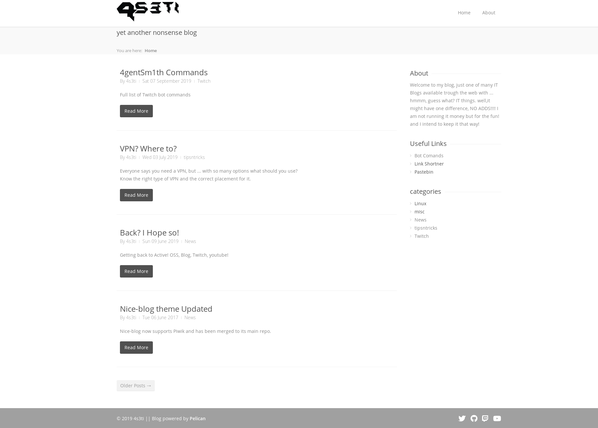

# Nice-Blog theme
Nice and simple pelican theme

# Screenshot
 

# Blogs Using Nice-Blog

https://4s3ti.net

# Extras

### Pages can have subtitles, just add:
```
Subtitle: Put your subtitle here
```

### Articles can have one cover image, just add:
```
Image: image_name.extension
```
**Image must be on** `/content/images`

### Article image gallery:
```
gallery:<galleryname>
```
**Images must be on** `./content/images/gallery/<galleryname>`

## Settings

**This settings must be on** `pelicanconf.py`

### Change theme color:
```
THEME_COLOR = 'blue'
```
**Available colors is on** `./static/css/colors`

### Menu left side Logo:
```
LOGO = 'logo.extension'
```
**If No logo specified, Blog title will be used instead.**

**Logo must be inside** `./content/images`

### Favicon

The favicon should be 16x16 and should be on `/content/images`

`FAVICON = 'ICONFILE.ico'`

### To select what to show on sidebar:
```
SIDEBAR_DISPLAY = ['about', 'categories', 'tags', 'extra']
```

### The text in sidebar About:
```
SIDEBAR_ABOUT = "Lorem ipsum dolor sit amet, consectetur adipisicing elit. Sequi quae hic dicta eius ad quam eligendi minima praesentium voluptatum? Quidem quaerat eaque libero velit impedit dicta, repudiandae sapiente. Deserunt, excepturi."
```

### Extra Side bar content

```
#What to show in extra content title
EXTRA_TITLE = 'Useful Links'

#Adds text
EXTRA_CONTENT = 'Test extra content'

#Sows a list of links
EXTRA_LINKS = (('Bot Comands', 'https://4s3ti.net/4gentsm1th-commands.html'),
                ('Link Shortner', 'https://s.4s3ti.net'),
                ('Pastebin', 'https://paste.4s3ti.net'),)
```


### Copyright text:
```
COPYRIGHT = "Text Here "
```

### To enable gallery plugin support:
```
PLUGINS_PATHS = ['PluginsRelativePath', 'or/absolute/path/to/plugins/dir']
PLUGINS = ['gallery']
GALLERY_PATH = 'images/gallery/'
```

### Analytics

Any analytics script should be supported.

create file containing the script provided by your analytics platform.

**OBS** File should be at the same level as your pelicanconf.py file
```
website
  |
  --content/
  --pelicanconf.py
  --analytics_script
```
Add the following to your pelicanconf File

```
analytics = open("analytics_script", "r")
ANALYTICS_CODE = analytics.read()
```
**OBS:** Make sure that `open("analytics_script")` matches your file name


### Did you like nice-blog? do you use it on your pelican blog?

let us know or just add it to README.MD and make a pull request

### Want to help out and contribute?

make a pull request, open an issue, let others know about this project ... there are plenty of ways to contribute, if you want to, just do it!
